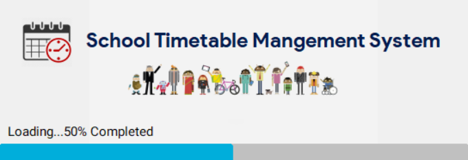
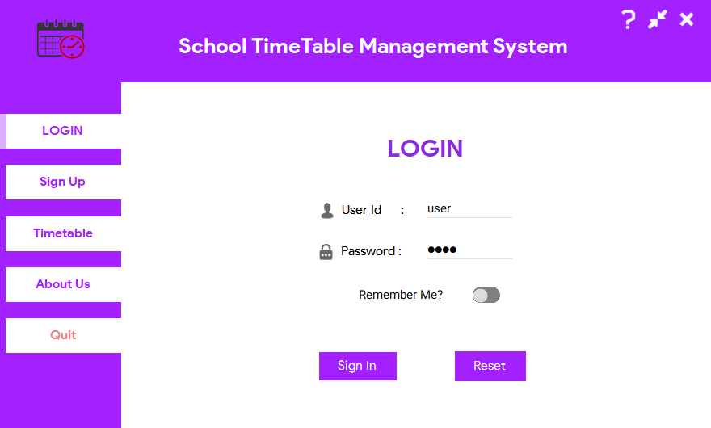
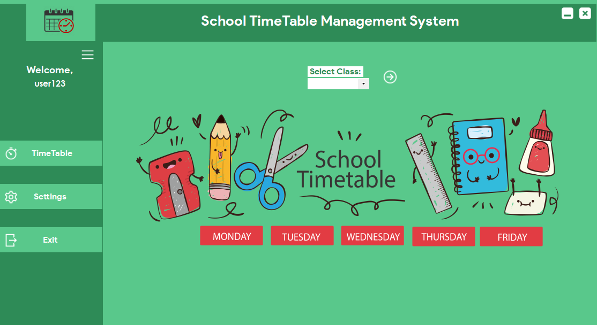
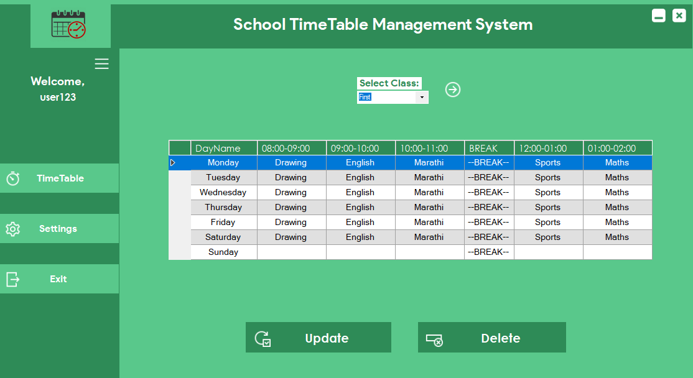
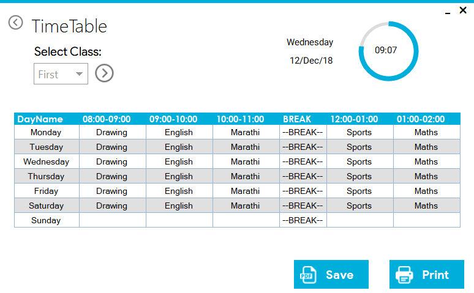
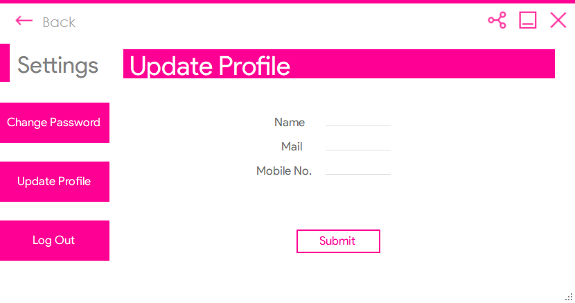
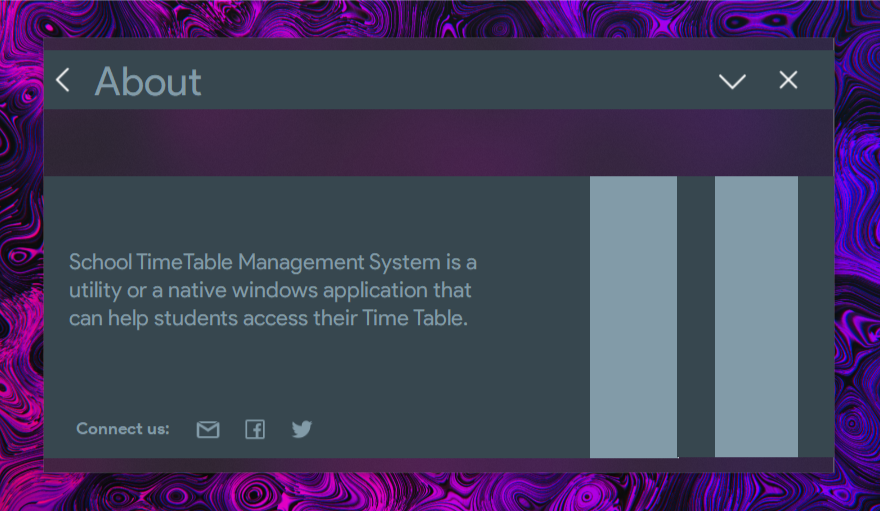

# School-Timetable
My Experience with WinForm Frameworks.

## School Timetable System

This project was just my experiments on UI/UX on native windows application.I used different frameworks like Bunifu,DevExpress and Material Library to achieve modern aesthetics in a native application by keeping it simple.

- LOADING/SPLASH SCREEN

- LOG OUT SPLASH 

A multicolored logout splash screen while the session is closed and a great fusion of material and metro design.

- LOGIN FORM

This is the view of Login screen.It consist of tab buttons to switch over to SignUp Paage or other.

- MAIN PAGE

This is the main view of admin/staff panel which is easy to understand even for non technical staff .

- Time-Table View

Choosing the right timetable is easy just select the class from option.Users can have a wide view of timetable they can also change the contents of timetable easily.

- Settings Panels

This is Settings window beautifully designed inspired from material design.
 

- About WinForm

About the application inspired from acrylic design fused with materialistic elements which is our weapon of choice.

